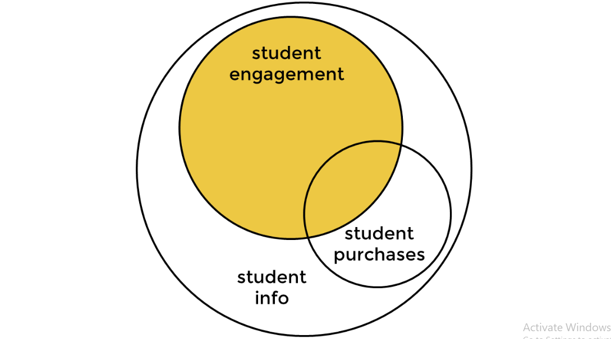

# 📊 Free-to-Paid Conversion Rate Analysis with SQL

<p align="center">
  
</p>

## 📋 Table of Contents
- [Project Overview](#-project-overview)
- [Business Questions](#-business-questions)
- [Dataset Description](#-dataset-description)
- [Methodology](#-methodology)
- [SQL Solution Approach](#-sql-solution-approach)
- [Results](#-results)
- [Key Insights & Interpretation](#-key-insights--interpretation)
- [Technical Skills Demonstrated](#-technical-skills-demonstrated)
- [Project Structure](#-project-structure)
- [How to Run](#-how-to-run)
- [Future Improvements](#-future-improvements)

---

## 🎯 Project Overview

This project analyzes the **free-to-paid conversion rate** of students on the 365 Data Science platform. The goal is to understand user behavior from registration through engagement to subscription purchase, providing actionable business insights. 

**Key Objective:** Determine what fraction of students who watch a free lecture eventually purchase a subscription, and analyze the time patterns in their journey.

**Source:** 365 Data Science SQL Course Project

---

## ❓ Business Questions

This analysis answers the following critical business questions:

| # | Question |
|---|----------|
| 1 | What is the **free-to-paid conversion rate** of students who have watched a lecture on the 365 platform? |
| 2 | What is the **average duration** between the registration date and when a student watches a lecture for the first time? |
| 3 | What is the **average duration** between the date of first-time engagement and when a student purchases a subscription?  |
| 4 | How can we **interpret these results**, and what are their implications for the business? |

---

## 🗄️ Dataset Description

### Database:  `db_course_conversions`

The analysis uses three interconnected tables:

| Table | Description | Key Fields |
|-------|-------------|------------|
| `student_info` | Contains student registration information | `student_id`, `date_registered` |
| `student_engagement` | Records of lecture viewing activity | `student_id`, `date_watched` |
| `student_purchases` | Purchase transaction records | `student_id`, `date_purchased` |

### Data Relationships

The Venn diagram above illustrates how the three tables relate:

- **student_info** (outer circle): Contains ALL registered students
- **student_engagement** (yellow/shaded): Students who watched at least one lecture - this is a SUBSET of student_info
- **student_purchases** (overlapping circle): Students who made a purchase - partially overlaps with engagement

**Key Insight:** Not all students who register will watch lectures, and not all who watch will purchase.  Our analysis focuses on the yellow shaded region - students who have engaged with content.

---

## 🔬 Methodology

### Approach Overview

```
┌─────────────────┐     ┌─────────────────┐     ┌─────────────────┐
│   TASK 1        │     │   TASK 2        │     │   TASK 3        │
│   Create        │ ──► │   Calculate     │ ──► │   Interpret     │
│   Subquery      │     │   Metrics       │     │   Results       │
└─────────────────┘     └─────────────────┘     └─────────────────┘
```

### Task 1: Create the Subquery (Data Preparation)

**Objective:** Create a result dataset by joining the three tables with the following columns: 

| Column | Type | Description |
|--------|------|-------------|
| `student_id` | INT | Unique identification of a student |
| `date_registered` | DATE | Date when student registered on the platform |
| `first_date_watched` | DATE | Date of first engagement (first lecture watched) |
| `first_date_purchased` | DATE | Date of first purchase (NULL if no purchase) |
| `days_diff_reg_watch` | INT | Days between registration and first watch |
| `days_diff_watch_purch` | INT | Days between first watch and first purchase |

**Filter Criteria:**
- Include students where `first_date_watched <= first_date_purchased`
- Include students who watched but never purchased (NULL purchases)

**Sanity Check:** Result should contain **20,255 records**

### Task 2: Create the Main Query (Metric Calculation)

**Objective:** Calculate three key business metrics using the subquery: 

| Metric | Formula | Description |
|--------|---------|-------------|
| `conversion_rate` | (Students who purchased / Students who watched) × 100 | Percentage of engaged students who convert to paid |
| `av_reg_watch` | SUM(days_diff_reg_watch) / COUNT(days_diff_reg_watch) | Average days from registration to first lecture |
| `av_watch_purch` | SUM(days_diff_watch_purch) / COUNT(days_diff_watch_purch) | Average days from first lecture to purchase |

### Task 3: Interpretation

**Objective:** Analyze the results considering: 
- Distribution symmetry (mean vs median vs mode)
- Outliers and their impact
- Common patterns in user behavior
- Business implications

---

## 💻 SQL Solution Approach

### Task 1: Creating the Subquery

**Step 1: Join the Tables**

```sql
FROM
    student_engagement e
        JOIN
    student_info i ON e.student_id = i.student_id
        LEFT JOIN
    student_purchases p ON e.student_id = p. student_id
```

**Why these JOINs? **
- `INNER JOIN` with `student_info`: All engaged students are registered (engagement is subset of info)
- `LEFT JOIN` with `student_purchases`: Not all engaged students purchase, so we keep NULL values for non-purchasers

**Step 2: Select Required Columns with Aggregations**

```sql
SELECT 
    e.student_id,
    i.date_registered,
    MIN(e.date_watched) AS first_date_watched,
    MIN(p.date_purchased) AS first_date_purchased,
    DATEDIFF(MIN(e.date_watched), i.date_registered) AS days_diff_reg_watch,
    DATEDIFF(MIN(p.date_purchased), MIN(e.date_watched)) AS days_diff_watch_purch
```

**Why MIN()?**
- A student may watch multiple lectures - we need the **FIRST** date
- A student may make multiple purchases - we need the **FIRST** purchase date

**Why DATEDIFF()?**
- Calculates the difference in days between two dates
- Syntax: `DATEDIFF(later_date, earlier_date)`
- Returns NULL if either date is NULL

**Step 3: Group and Filter**

```sql
GROUP BY e.student_id
HAVING first_date_purchased IS NULL
    OR first_date_watched <= first_date_purchased;
```

**Why HAVING instead of WHERE?**
- We're filtering on aggregated columns (`first_date_watched`, `first_date_purchased`)
- `WHERE` filters before aggregation, `HAVING` filters after

**Why this filter condition?**
- `first_date_purchased IS NULL`: Include students who never purchased
- `first_date_watched <= first_date_purchased`: Only include logical conversions (watched before purchasing)
- Uses `OR` because these conditions are mutually exclusive

### Task 1 Output (20,255 records):

<p align="center">
  
</p>

### Task 2: Creating the Main Query

**Wrapping the Subquery:**

```sql
SELECT 
    ROUND(COUNT(first_date_purchased) / COUNT(first_date_watched), 2) * 100 AS conversion_rate,
    ROUND(SUM(days_diff_reg_watch) / COUNT(days_diff_reg_watch), 2) AS av_reg_watch,
    ROUND(SUM(days_diff_watch_purch) / COUNT(days_diff_watch_purch), 2) AS av_watch_purch
FROM
    (SUBQUERY) a;
```

**Why COUNT() works for conversion_rate:**
- `COUNT(first_date_purchased)`: Counts only non-NULL values (students who purchased)
- `COUNT(first_date_watched)`: Counts all engaged students
- Division gives the conversion ratio

---

## 📈 Results

### Final Output: 

<p align="center">
  
</p>

### Summary of Results:

| Metric | Value | Interpretation |
|--------|-------|----------------|
| **conversion_rate** | **11.00%** | 11 out of every 100 students who watch a lecture purchase a subscription |
| **av_reg_watch** | **3.42 days** | On average, students take ~3.5 days to watch their first lecture after registering |
| **av_watch_purch** | **26.25 days** | On average, students take ~26 days from first lecture to purchase |

### Additional Statistics (from Interpretation)

| Metric | Mean | Median | Mode |
|--------|------|--------|------|
| Days (Registration → Watch) | 3.42 | 0 | 0 |

---

## 💡 Key Insights & Interpretation

### 1. Conversion Rate Analysis (11%)

**Observation:** The conversion rate of approximately 11% means that for every 100 students who come to the platform and watch a lecture, roughly 11 of them purchase a subscription.

**Context:**
- At first glance, this may seem relatively low
- However, this is reasonable for a freemium education platform because:
  - Many students register out of **curiosity**
  - The platform targets a **beginner audience** who may be exploring options
  - Some users prefer to take their first steps in data science **elsewhere**
  - Educational purchase decisions require **consideration time**

**Business Implication:** Focus on converting the engaged users rather than just increasing registrations.

### 2. Registration to First Watch (3.42 days average)

**Key Finding:** The **mean is 3.42 days**, but both **median and mode are 0 days**. 

**What this tells us:**
- **Mode = 0**:  The most common behavior is watching a lecture on the **same day** as registration
- **Median = 0**: At least half of all students watch on registration day
- **Mean = 3.42**: Higher due to **outliers** - some students wait much longer

**Distribution:** This indicates a **right-skewed distribution**:
```
Most students ──────► Immediate engagement (Day 0)
Some students ──────► Delayed engagement (outliers pulling mean up)
```

**Business Implication:**
- The platform's onboarding is effective - most users engage immediately
- Consider reaching out to users who haven't engaged within the first week
- Investigate why some users delay (confusion about where to start?)

### 3. First Watch to Purchase (26.25 days average)

**Observation:** Students take nearly a month on average from their first lecture to making a purchase decision.

**Possible Interpretations:**
- **Shorter span** would suggest compelling content or effective up-sell strategies
- **Longer span** might indicate students are: 
  - Waiting for promotional offers/discounts
  - Evaluating the platform thoroughly
  - Completing free content before committing
  - Facing financial decision-making time

**Business Implication:** Consider targeted offers around the 3-4 week mark after first engagement.

### 4. Distribution Insights

**Right-Skewed Data:**
- When mean > median, outliers exist on the higher end
- Some students take exceptionally long to decide
- The "typical" student behavior is better represented by median/mode

**Common Patterns:**
- A mode of 0 for registration-to-watch suggests the registration process and initial platform experience are user-friendly
- Most students begin watching on their registration day or the day after

---

## 🛠️ Technical Skills Demonstrated

| Category | Skills |
|----------|--------|
| **SQL Joins** | INNER JOIN, LEFT JOIN, Multi-table joins |
| **Aggregations** | MIN(), COUNT(), SUM(), GROUP BY |
| **Subqueries** | Derived tables in FROM clause |
| **Date Functions** | DATEDIFF() for date calculations |
| **Filtering** | HAVING clause with aggregated columns |
| **Formatting** | ROUND() for decimal precision |
| **Business Logic** | Converting requirements to SQL queries |
| **Data Interpretation** | Statistical analysis and business insights |

---

## 📁 Project Structure

```
sql-conversion-analysis/
│
├── README.md                         # Project documentation (this file)
│
├── data/
│   └── db_course_conversions. sql     # Database file
│
├── sql/
│   ├── subquery.sql                  # Task 1: Create analysis dataset
│   └── main_query.sql                # Task 2: Calculate metrics
│
├── docs/
│   ├── requirements.md               # Problem statement
│   └── interpretation. md             # Detailed analysis
│
└── images/
    ├── venn_diagram.png              # Data relationships
    ├── subquery_results.png          # Task 1 output
    └── final_results.png             # Task 2 output
```

---

## 🚀 How to Run

### Prerequisites
- MySQL Server 8.0+
- MySQL Workbench (recommended) or any SQL client

### Steps

1. **Clone the repository**
   ```bash
   git clone https://github.com/TusharVarma077/sql-conversion-analysis.git
   ```

2. **Import the database**
   ```sql
   SOURCE data/db_course_conversions. sql;
   ```

3. **Run the subquery** (Task 1)
   ```sql
   SOURCE sql/subquery.sql;
   -- Expected:  20,255 rows
   ```

4. **Run the main query** (Task 2)
   ```sql
   SOURCE sql/main_query.sql;
   -- Expected: conversion_rate=11.00, av_reg_watch=3.42, av_watch_purch=26.25
   ```

---

## 🔜 Future Improvements

- [ ] **Python Analysis:** Add median/mode calculations using Python (pandas)
- [ ] **Visualizations:** Create distribution graphs for better insight
- [ ] **Cohort Analysis:** Compare conversion rates by registration month
- [ ] **Time Series:** Analyze how conversion rate changes over time
- [ ] **Segmentation:** Break down by user demographics if available

---

## 📚 What I Learned

1. **Complex SQL JOINs** - Combining multiple tables with different relationships
2. **Subqueries** - Using derived tables for multi-step analysis
3. **Business Metrics** - Translating business questions into SQL calculations
4. **Data Interpretation** - Understanding what numbers mean in business context
5. **Statistical Thinking** - Recognizing skewed distributions and outlier effects

---

## 👤 Author

**Tushar Varma**
- GitHub: [@TusharVarma077](https://github.com/TusharVarma077)

---

*Project completed:  December 2025*